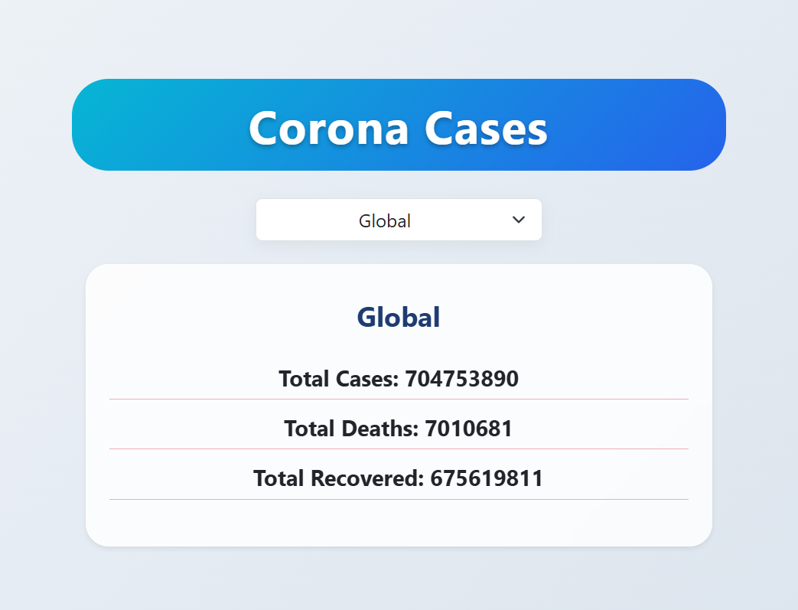

# CORONA-API

A simple web application to display COVID-19 data using APIs. This project uses HTML, CSS (Bootstrap), and JavaScript.

---

## Project Structure

```text
CORONA-API/
├── css/
│ └── bootstrap.min.css
├── img/
│ ├── premium_photo-166490...png
│ └── screenshot-output.png
├── js/
│ ├── bootstrap.bundle.min.js
│ └── script.js
└── index.html
```

yaml
Copy code

---

## Features

- Responsive design using Bootstrap
- Fetches and displays COVID-19 data dynamically
- Clean and simple UI
- Easy to customize

---

## How to Use

1. Clone or download the repository.
2. Open `index.html` in a web browser.
3. Ensure internet connection is available for API requests.
4. Explore the live data.

---

## Technologies Used

- HTML5
- CSS3 (Bootstrap)
- JavaScript (ES6)
- External COVID-19 API

---

## Screenshot



---

## Live Demo

[View the Live Project](https://js-exam-sage.vercel.app/)

---

## License

This project is open source and free to use.